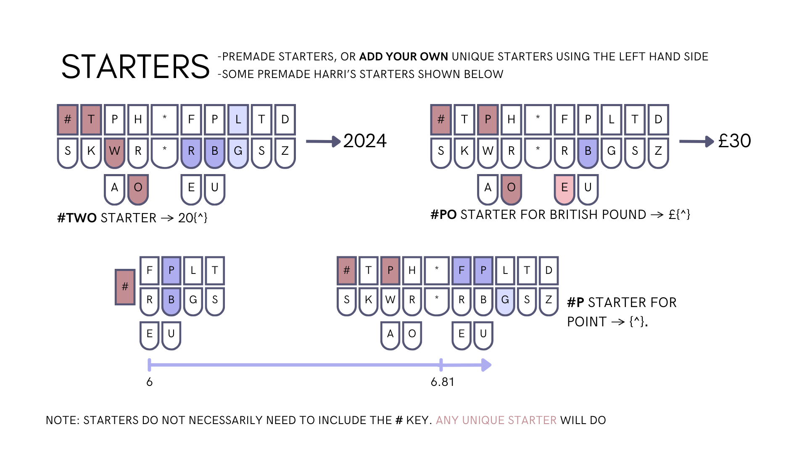
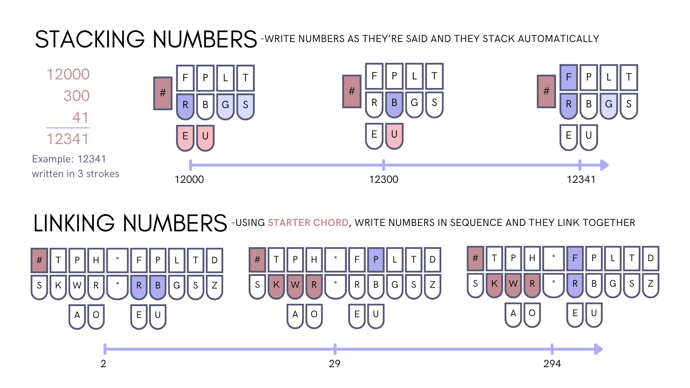

# Harri_numbers
Inspired by Lapwing numbers, but 2 numpads instead of 1

Left hand = Activate Harri numbers Right fingers = any two digit number Right thumbs = stick up to three 0's on the end

Starters:
Good for if you don't have a `#` key, or you want different modes, like typing in years or currencies

Connecting strokes:
you can either stack strokes into each other (may have to define which starters use linking)
Or you can link strokes one after another

12,000
   300
    45

Left hand 20 starter
Right hand 24
20 + 24

Left hand defines the mode [FRPB] defines the first number [LGTS] defines the second number [EU] defines the number of zeros
