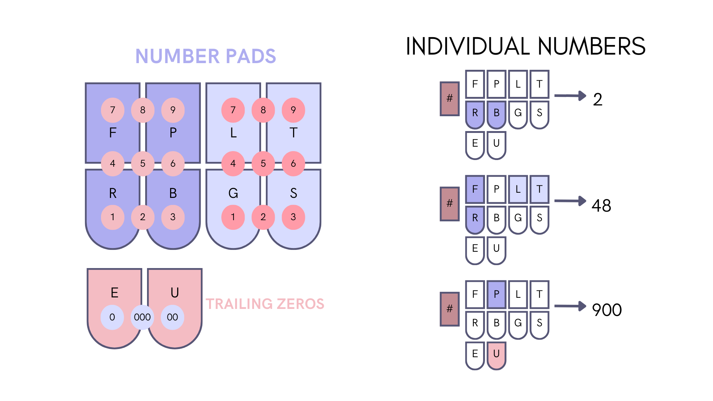
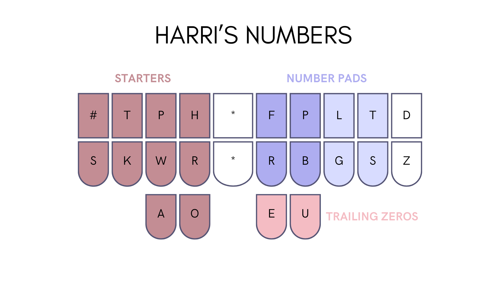
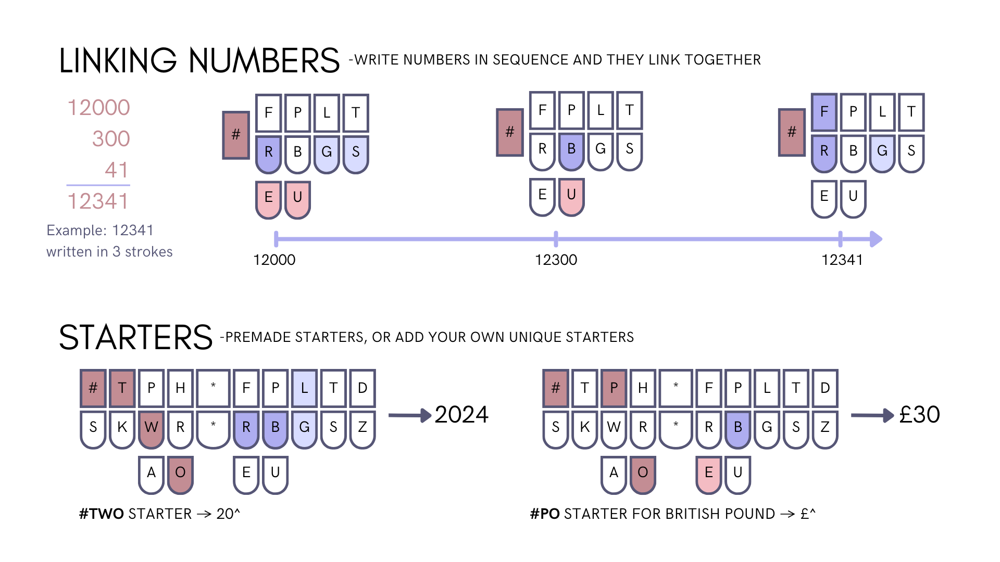

# Harri_numbers
Inspired by Lapwing numbers, but 2 numpads instead of 1

Left hand = Activate Harri numbers Right fingers = any two digit number Right thumbs = stick up to three 0's on the end

Featuring modes:
Linking mode 12,345 would written in 3 strokes:
Years mode 2024 would written in 1 stroke:

12,000
   300
    45

Left hand 20 starter
Right hand 24
20 + 24

Left hand defines the mode [FRPB] defines the first number [LGTS] defines the second number [EU] defines the number of zeros
